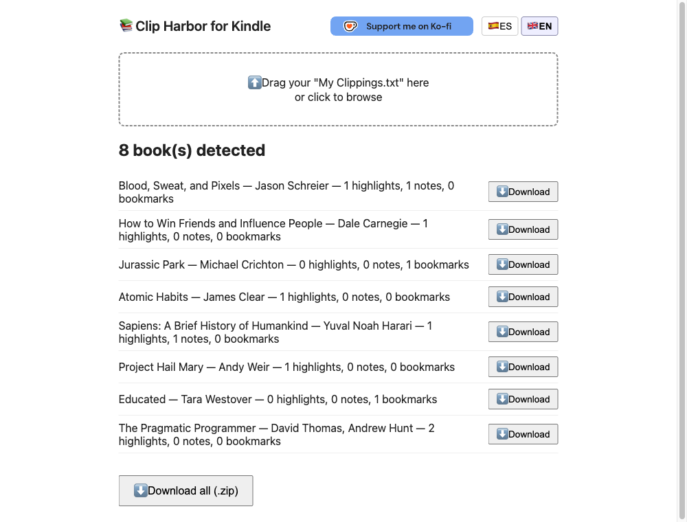
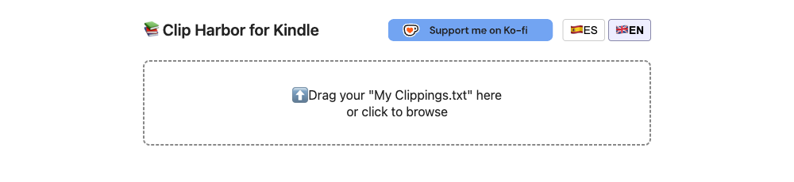
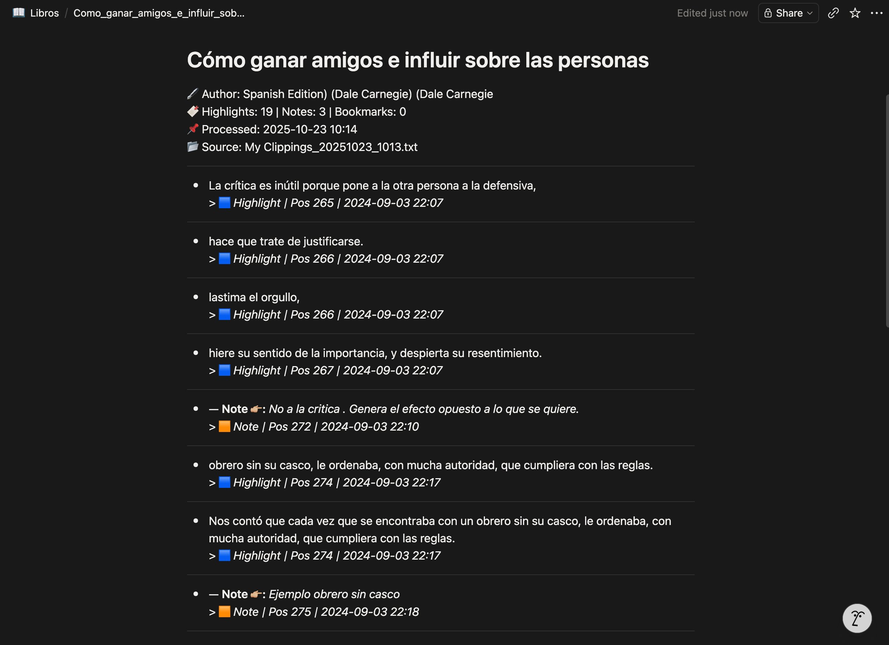

[EN](README.md) | **ES**


# Clip Harbor for Kindle — Exportador de subrayados de Kindle a Markdown para Notion
### Proyecto de QA / automatización | Python · JavaScript · Web · Markdown · Notion

[](https://github.com/melinDross/ClipHarborKindle/actions/workflows/deploy-pages.yml)
[](https://melindross.github.io/ClipHarborKindle/)
[](https://github.com/melinDross/ClipHarborKindle/commits/main)
[](LICENSE)



Clip Harbor for Kindle convierte automáticamente los subrayados y notas que haces en un Kindle en archivos Markdown listos para importar a Notion. Nació como un script de línea de comandos en Python; hoy la versión activamente mantenida es una **web sin instalación**, pensada para cualquier persona, sin necesidad de tocar una terminal: **[melindross.github.io/ClipHarborKindle](https://melindross.github.io/ClipHarborKindle/)**. Arrastra tu `My Clippings.txt` y descarga el `.zip` (o cada `.md` por separado) — todo se procesa en tu navegador, el fichero nunca se envía a ningún servidor.

**Live:** [melindross.github.io/ClipHarborKindle](https://melindross.github.io/ClipHarborKindle/)

Este README documenta el proyecto como un **caso de estudio de QA y automatización**: no solo qué se construyó, sino los bugs reales encontrados, la versión cancelada a mitad de desarrollo, y el razonamiento detrás de cada decisión de diseño — el mismo tipo de rastro que dejaría para un compañero que retomase este código en frío.

---

## 🚀 Quick start

No hace falta instalar nada — la herramienta es un sitio estático, así que la vía más rápida es usarla directamente:

1. Abre **[melindross.github.io/ClipHarborKindle](https://melindross.github.io/ClipHarborKindle/)**
2. Arrastra el `My Clippings.txt` de tu Kindle sobre la zona de drop (o haz clic para seleccionarlo)
3. Descarga el `.zip` (todos los libros) o cada `.md` individualmente por libro

Para ejecutarlo desde un clon local en su lugar:

```bash
git clone https://github.com/melinDross/ClipHarborKindle.git
cd ClipHarborKindle
open web/index.html   # o haz doble clic — sin servidor, sin build
```

El CLI original en Python también sigue funcionando, para quien prefiera terminal y ya tenga `My Clippings.txt` a mano — ver "⚙️ Ejecutarlo en local" más abajo.

---

## 💡 De dónde vino la idea

El punto de partida no fue "vamos a construir un exportador de Kindle" en abstracto — fue probar una herramienta existente y que se quedara corta. Probé [clippings.io](https://clippings.io), una herramienta de terceros para exportar highlights de Kindle, y el resultado no me convenció: formato plano, sin estructura visual útil, sin metadatos relevantes, y sin ningún tipo de vinculación entre notas y los subrayados a los que pertenecían.


Eso me llevó a preguntarme cuánto costaría hacerlo yo mismo, con exactamente el output que necesitaba. Este proyecto es la respuesta a esa pregunta.

### Qué es realmente `My Clippings.txt`

Cuando subrayas algo en un Kindle, el dispositivo lo guarda automáticamente en un fichero de texto plano llamado `My Clippings.txt`, que vive en la memoria interna del lector. Este fichero acumula todas tus anotaciones de todos los libros, en el orden en que las hiciste, sin separación por libro ni estructura navegable.

El formato de cada entrada es propietario de Amazon:

```
Blood, Sweat, and Pixels (Jason Schreier)
- Your Highlight on Page 6 | Loc. 49-50 | Added on Thursday, June 13, 2024 10:38:24 PM

Developers everywhere talk about how hard it is to make games.
==========
Blood, Sweat, and Pixels (Jason Schreier)
- Your Note on Page 6 | Loc. 46-48 | Added on Thursday, June 13, 2024 10:28:16 PM

Con todos los imprevistos que surgieron durante el desarrollo...
==========
```

Cada bloque termina en `==========`. No hay estructura jerárquica, no hay relación explícita entre una nota y el subrayado al que pertenece, y el idioma de los metadatos cambia según la configuración del dispositivo. Sin procesar, ese fichero es ilegible en cualquier herramienta externa y prácticamente imposible de buscar o revisar.

Este proyecto resuelve exactamente eso: parsea el fichero, agrupa las anotaciones por libro, une automáticamente cada nota con su subrayado correspondiente, y genera un `.md` por libro con formato limpio, legible y compatible con Notion.

---

## 🙋 Para quién es

Para cualquier persona que use Kindle para leer y quiera llevar sus subrayados a un sistema de gestión del conocimiento como Notion, sin depender de apps de terceros, suscripciones ni APIs externas.

El caso de uso principal es el mío propio: leo con frecuencia, subrayo mucho y necesitaba poder revisar y buscar mis highlights en Notion sin el proceso manual de copiar y pegar entrada por entrada.

Hoy la mayoría de gente debería usar la versión web — no requiere nada instalado, solo un navegador. El CLI en Python sigue ahí para quien lo prefiera o ya lo tuviera integrado en su flujo: no tiene ninguna dependencia externa —no hay `pip install`, no hay cuenta en ningún servicio. Solo Python 3.9+ y el fichero del Kindle.

---

## 🛠️ Herramientas y tecnologías

### CLI original (Python — congelado, ver Fase 5)

| Elemento | Detalle |
|---|---|
| **Lenguaje** | Python 3.9+ (sin dependencias externas) |
| **Librerías estándar** | `re` (expresiones regulares), `pathlib` (rutas multiplataforma), `datetime`, `shutil` (copia de ficheros), `sys` |
| **Formato de entrada** | Texto plano UTF-8 — `My Clippings.txt` del Kindle |
| **Formato de salida** | Markdown (`.md`) con sintaxis compatible con Notion |
| **Sistemas operativos** | macOS y Windows (documentados y probados en ambos) |

La decisión de no usar dependencias externas fue deliberada: una herramienta personal tiene que funcionar en cualquier momento sin tener que gestionar entornos virtuales ni versiones de paquetes. Cero fricción de instalación.

### Versión web (JavaScript — activa, fuente de verdad actual)

| Elemento | Detalle |
|---|---|
| **Lenguaje** | JavaScript (ES modules nativos, sin transpilar) |
| **Build** | Ninguno — sin bundler, sin `npm install`, los módulos se cargan directamente en el navegador |
| **Dependencia** | [JSZip](https://stuk.github.io/jszip/), vendorizada (`web/vendor/jszip.min.js`), cargada de forma diferida solo para el botón "descargar todo (.zip)", con hash SRI pinneado |
| **Tests** | `node:test` + `node:assert` (built-in de Node, sin librería externa) — `web/parser.test.js`, `web/strings.test.js` |
| **Hosting / deploy** | GitHub Pages, desplegado automáticamente vía GitHub Actions en cada push a `main` que toque `web/` |
| **Seguridad** | CSP estricta (`script-src 'self'`, `frame-ancestors 'none'`), `Referrer-Policy`, sin `innerHTML` con datos dinámicos |
| **Accesibilidad** | `aria-live`, `aria-pressed`, drop-zone navegable por teclado, objetivos táctiles de 44×44px |

Ambas comparten **control de versiones** (Git + GitHub) y **herramienta de destino** (Notion — import manual o vía Notion Importer oficial).

---

## 🐛 Problemas técnicos resueltos

Una muestra de los problemas de ingeniería reales que surgieron en el proyecto — no una lista de features, una lista de "qué falló realmente y cómo se arregló":

- **Un regex roto corrompía silenciosamente el formato de posición más común de Kindle.** La clase de caracteres para rangos de posición estaba escrita como `[\-–—]` (guion, en-dash, em-dash). Ese guion precedido de barra invertida se interpreta como un *rango* Unicode entre `\` (0x5C) y `–` (0x2013) — no como una clase de caracteres literal — así que un guion ASCII normal (el formato que usa cualquier Kindle en inglés/español) fallaba silenciosamente al no matchear. `Loc. 49-50` se parseaba como `pos_start=49, pos_end=None` en vez de `(49, 50)`, rompiendo el pareado nota-subrayado por solapamiento de rango para el formato de entrada más común de todos. Corregido a `[-–—]`; verificado con `parse_pos('Loc. 49-50')` devolviendo `(49, 50)` en vez de `(49, None)`.
- **Paréntesis anidados en el título de un libro rompían el split título/autor — y generaban duplicados reales.** El regex `^(?P<title>.+?)\(\s*(?P<author>.+?)\)\s*$` no maneja títulos como `"Parque Jurásico (Z-Library) (Michael Crichton)"` (habitual cuando el ebook viene de una fuente no oficial) — capturaba `"Z-Library"` como autor. Esto generó dos ficheros distintos, `Parque_Jurasico.md` y `Parque_Jurásico.md`, para el mismo libro, ambos con el campo autor mal parseado — confirmado inspeccionando el output real en `Books/`, no solo leyendo el código. Corregido en el parser web tomando el *último* grupo de paréntesis sin anidar como autor (`^(.+)\s*\(([^()]+)\)\s*$`), cubierto por un test dedicado en `parser.test.js`.
- **Dos libros con el mismo título y distinto autor podían pisarse el fichero entre sí.** El nombre de fichero se generaba solo a partir del título. Corregido incluyendo el autor en el nombre (`Título (Autor).md`), con una clave de agrupación libre de colisiones (`JSON.stringify([título, autor])` en vez de concatenación de strings, que podía colisionar cuando los límites de palabra se desplazaban — p. ej. `"Foo"`+`"Bar Baz"` y `"Foo Bar"`+`"Baz"` concatenan ambos a `"Foo Bar Baz"`).
- **Un Kindle en un idioma no soportado exportaba en silencio, sin forma de saber que el idioma no se había reconocido.** La detección solo entendía palabras clave en inglés/español; cualquier otro caso significaba `lang: null` sin ninguna señal visible. Corregido votando el idioma por entrada a lo largo de un libro y mostrando un aviso explícito "⚠️ Idioma no reconocido" en la UI cuando ninguna entrada de un libro tenía idioma detectable — convirtiendo un fallo silencioso en uno visible.
- **Un highlight que contuviera la cadena literal `==========` en su propio texto podía confundirse con el delimitador de bloque.** El split original usaba `text.split('==========')`, que matchea esa subcadena en cualquier posición, no solo en su propia línea. Corregido partiendo línea a línea y tratando una línea como delimitador solo cuando es exactamente `==========` tras hacer trim.

---

## 🏗️ Cómo lo construí

### Fase 1 — Entender el problema real

Antes de escribir una sola línea de código, pasé tiempo analizando el fichero `My Clippings.txt` a mano. Necesitaba entender cuántos bloques distintos podía haber (highlight, note, bookmark), si el formato era estable o variaba entre libros y dispositivos, y qué información era relevante conservar y en qué orden.

Encontré inmediatamente que la relación nota–subrayado no era explícita en el fichero. Eso se convirtió en el problema central a resolver, y condicionó toda la arquitectura del script desde el inicio.

### Fase 2 — Parseo básico funcional (v1.1d)

El primer script funcional hacía lo esencial: dividir el fichero por `==========`, extraer título/autor/tipo/posición/texto de cada bloque, agrupar todo por libro (título + autor como clave), y generar un `.md` por libro con los highlights como bullets y la metadata en blockquote. En esta versión ya estaba implementado el pareado de notas con sus subrayados por solapamiento de posición, el soporte para formato de fecha en inglés y español, y la sanitización de nombres de fichero. Lo que no tenía: backups del fichero original ni log de ejecución.

### Fase 3 — Identificar riesgos y añadir salvaguardas (v1.1e)

Tras usar v1.1d durante un tiempo, identifiqué un riesgo operacional real: el script sobreescribe los `.md` de salida en cada ejecución. Si algo fallaba en el parsing —o si experimentaba con cambios— podía perder el trabajo anterior sin posibilidad de recuperarlo.

Añadí dos mecanismos de seguridad: **backup automático** de `My Clippings.txt` a `backups/` con timestamp antes de cada ejecución, y un **log de ejecución** (`logs/last_run.txt`) que registra fecha, libros procesados, totales de highlights/notas/bookmarks, fichero fuente y nombre del backup generado — convirtiendo cada ejecución en algo auditable.

### Fase 4 — Experimentación con deduplicación (v1.2 — cancelada)

Intenté añadir lógica de deduplicación: detectar si un highlight ya había sido exportado en una ejecución anterior y omitirlo para no tener duplicados al re-importar a Notion. Desarrollé la lógica y la probé, pero la descarté antes de mergearla — comparar contra un estado anterior introducía falsos negativos: highlights legítimos omitidos silenciosamente. Para una herramienta cuya función principal es no perder ninguna anotación, esa inestabilidad era inaceptable. **Decisión de QA:** mantener v1.1e como versión estable y cancelar v1.2 en lugar de publicar algo que funcionaba "casi siempre". Un fallo silencioso en este contexto —perder un highlight sin avisar— es peor que no tener la feature.

### Fase 5 — Migración a web: `parser.js` pasa a ser la fuente de verdad

v1.1e quedó como versión estable del CLI, pero seguía teniendo una barrera de entrada real: requería Python instalado, conocimiento mínimo de terminal, y clonar o descargar el repo. Para que cualquier persona con un Kindle pudiera usar la herramienta —no solo quien programa— decidí portar toda la lógica de parsing a JavaScript y ejecutarla 100% en el navegador, sin backend: arrastras el fichero, el procesado ocurre en tu máquina, descargas el resultado. Sin servidor de por medio, el `My Clippings.txt` (que puede contener años de notas personales) nunca sale de tu equipo.

Esto planteó una pregunta de gobernanza inmediata: con la misma lógica viviendo ahora en dos sitios (el `.py` y el `.js`), ¿dónde se arreglan los bugs que vaya encontrando? Mantener dos implementaciones sincronizadas a mano, en dos lenguajes distintos, es una receta para divergencia silenciosa —arreglar algo en uno y olvidarlo en el otro hasta que alguien lo nota por accidente. Así que tomé una decisión explícita de gobernanza, documentada en `CLAUDE.md`:

> **`web/parser.js` pasa a ser la fuente de verdad de la lógica de parsing.** `cli/parse_kindle_notion_v1_1e.py` queda **congelado**: sigue funcionando para quien lo ejecute por CLI, pero no recibe más fixes ni features de parsing. Toda mejora a partir de este punto se implementa solo en `parser.js`.

Con esa decisión tomada, la primera ronda de trabajo sobre la web fue un MVP funcional (drag&drop → parseo → descarga `.zip`) más un selector de idioma de interfaz (ES/EN, independiente del idioma de los `.md` generados). La segunda ronda —ya con el CLI oficialmente congelado— resolvió varios bugs largamente documentados, deliberadamente **no portados al `.py`**: la colisión de nombre de fichero, el regex título/autor con paréntesis anidados, el aviso de idioma no soportado (ver "Problemas técnicos resueltos" arriba), además de detección de idioma más robusta cuando una nota se fusiona dentro de un highlight, split de bloques a prueba de colisión con el delimitador, descarga individual por libro (no solo el `.zip` completo), y accesibilidad básica (teclado, `aria-live`, `aria-pressed`). Esta ronda fue también la primera vez que el proyecto incorporó **tests automatizados** — ver "Por qué cambió ese criterio" para el porqué.

### Fase 6 — Endurecimiento de seguridad, accesibilidad y rendimiento

Una auditoría multidisciplinar completa (seguridad, accesibilidad WCAG 2.2 AA, SEO/GEO, rendimiento, mobile) sacó a la luz diez hallazgos, de los cuales los quick wins de mayor valor se implementaron de inmediato: directiva CSP `frame-ancestors 'none'`, un `<h1>` real (la página no tenía ningún heading por encima del `<h2>`, rompiendo la jerarquía), objetivos táctiles mínimos de 44×44px en el selector de idioma y los botones de descarga por libro, hash SRI pinneado en el JSZip vendorizado, carga diferida de JSZip solo cuando se pulsa "descargar todo" (la descarga individual por libro nunca lo necesitó, así que cada visita pagaba ese coste de parseo sin motivo), cabecera `Referrer-Policy`, y un header responsive que hace wrap en vez de comprimirse en viewports estrechos.

---

## 📸 Capturas

| Landing (modo claro) | Landing (modo oscuro) |
|---|---|
|  |  |

| Comparativa con clippings.io | Resultado real importado en Notion |
|---|---|
|  |  |

Las cuatro capturas de arriba son de la app real en vivo y una generación real — ninguna es un mockup. Las de landing son de [melindross.github.io/ClipHarborKindle](https://melindross.github.io/ClipHarborKindle/); el resultado importado en Notion ("Cómo ganar amigos e influir sobre las personas") es un libro real procesado con la herramienta.

---

## 🧪 Cómo lo he ido testando

El CLI no tiene tests unitarios automatizados, y es una decisión consciente que merece explicación. La web sí los tiene — ver "Por qué cambió ese criterio" más abajo.

### Enfoque de validación manual estructurada (CLI)

El testing fue manual e iterativo, pero con un criterio claro en cada ciclo:

**1. Pruebas con fichero real propio.** El fichero de entrada es mi `My Clippings.txt` personal, con más de 200 highlights de más de 12 libros en inglés y en español — cobertura de variabilidad real desde el primer día, sin fabricar datos de prueba artificiales.

**2. Inspección visual del output.** Tras cada cambio, comparaba el `.md` generado contra el fichero original a mano: ¿están todos los highlights? ¿las notas están unidas al highlight correcto? ¿los bookmarks se exportan sin perder información? ¿el formato se ve bien al importar en Notion?

**3. Comparación entre versiones.** Al pasar de v1.1d a v1.1e, ejecuté ambas versiones sobre el mismo fichero de entrada y comparé los outputs línea a línea. El criterio era claro: v1.1e no puede producir ningún resultado diferente en el contenido de los `.md`, solo añadir backup y log. Esa comparación fue mi test de regresión manual.

**4. Pruebas de edge cases identificados**

| Caso | Qué comprobé |
|---|---|
| Libros sin autor identificado | El script no falla; exporta el libro sin campo autor |
| Nota sin highlight asociado | Se exporta como entrada independiente, no se pierde |
| Bookmark sin texto | Se representa como "Bookmark at Page X" |
| Título con caracteres especiales (`:`, `"`, `¿`) | El nombre de fichero se sanitiza correctamente |
| Fichero en español (Kindle configurado en ES) | Fechas y tipos de anotación se parsean correctamente |
| Fichero con BOM (``) | Se elimina antes del procesado |
| Ejecución sin `My Clippings.txt` presente | Mensaje de error claro y salida controlada |

**5. Validación en destino.** El test final siempre fue importar el output en Notion y verificar que el formato sobrevive: que los bullets se renderizan como lista, que los blockquotes aparecen como blockquotes, y que los separadores `---` funcionan como divisores visuales.

### Por qué no automaticé los tests (en el CLI)

Añadir tests unitarios habría requerido crear fixtures de `My Clippings.txt` con casos conocidos. Factible, pero un trabajo adicional no justificado para una herramienta personal con un único contribuidor. El riesgo de regresión lo gestioné con la comparación manual entre versiones y con el backup automático incorporado al script, que actúa como red de seguridad ante cualquier fallo inesperado. Si el proyecto escalara a múltiples contribuidores, o el formato de Amazon cambiase con frecuencia, los tests automatizados serían el siguiente paso natural.

### Por qué cambió ese criterio en la versión web

La versión web tiene tests automatizados desde su primera línea de código (`web/parser.test.js` + `web/strings.test.js`, usando `node:test`/`node:assert` —built-in de Node, sin dependencia externa— actualmente **59 tests**, todos sobre comportamiento real, no sobre mocks). No es una contradicción con el razonamiento anterior, es el mismo criterio de QA aplicado a un contexto distinto:

- **El "único contribuidor" deja de ser literal.** El desarrollo de la web se hace en rondas con múltiples subagentes trabajando tarea a tarea sobre el mismo código (`parser.js`, `app.js`, `strings.js`). Sin una suite que se ejecute en segundos tras cada cambio, cada subagente tendría que re-verificar manualmente todo lo que ya funcionaba — exactamente el tipo de regresión silenciosa que un test detecta gratis.
- **La superficie de cambio es mayor y más entrelazada.** Cada ronda toca varias funciones que se llaman entre sí (`parseEntries` → `pairNotes` → `detectBookLang` → `exportBooks`). Una comparación manual línea a línea —el método usado para v1.1d→v1.1e— deja de ser practicable cuando hay 8-9 commits pequeños e interdependientes en una sola sesión de trabajo.
- **El coste de automatizar bajó.** `node:test` viene incluido en Node sin instalar nada, y no hace falta levantar un navegador: las funciones de parsing son puras (texto en, objetos en, sin DOM), así que testearlas es tan simple como en Python — el motivo original para no automatizar (esfuerzo no justificado) deja de aplicar.

El criterio de fondo no cambió: **automatizar cuando el coste de no hacerlo supera al de hacerlo.** En el CLI personal de un solo contribuidor, no lo superaba. En una web que itera con un flujo multi-agente y revisiones por tarea, sí.

---

## 🎯 Decisiones de diseño relevantes

**Sin dependencias externas (CLI).** Podría haber usado librerías como `click` para la CLI o `pytest` para los tests. Decidí no hacerlo para que cualquier persona pueda clonar el repo y ejecutarlo inmediatamente sin pasos adicionales.

**Backup antes de procesar, no después (solo CLI).** El backup se hace al inicio de la ejecución, antes de que el script toque nada. Si el script falla a mitad, el backup ya está hecho. El orden importa.

**La web no hace backup del `My Clippings.txt` — y es intencionado, no un descuido.** El backup del CLI existe porque el script **sobrescribe** los `.md` de salida en cada ejecución: si el parsing fallaba, se perdía el output anterior sin el fichero fuente a mano para reprocesar. La web nunca escribe nada en tu disco salvo lo que descargas explícitamente — lee el `.txt` en memoria del navegador, lo procesa, y el original queda intacto donde estaba. No hay nada que la web pueda sobrescribir, así que no hay nada que respaldar. El único riesgo distinto es cerrar la pestaña antes de descargar el resultado (no el original) — un riesgo de UX, no de pérdida de datos.

**Separadores `---` en el output.** Notion tiene comportamientos inconsistentes con algunos elementos Markdown. Los separadores horizontales son uno de los pocos elementos que se renderizan de forma fiable en imports. La elección no fue estética, fue funcional.

**Multiidioma configurable, no automático (en el CLI).** La detección automática del idioma por libro fue evaluada y descartada en el `.py` porque generaba falsos positivos en títulos con palabras en varios idiomas. El enfoque de configuración explícita (`PER_BOOK_LANG`) es menos "mágico" pero más predecible y menos propenso a errores silenciosos. En la web sí se implementó detección automática por mayoría de voto entre las entradas de cada libro (`detectBookLang`), con un aviso explícito cuando ninguna entrada tiene idioma reconocible — la diferencia es que ahora el fallo se hace visible en vez de silencioso.

**Una sola fuente de verdad para el parsing, no dos sincronizadas a mano.** Al portar la lógica a JavaScript, la alternativa habría sido mantener `.py` y `.js` arreglando los mismos bugs en paralelo. Se descartó deliberadamente: la sincronización manual entre dos lenguajes es un mecanismo de divergencia silenciosa, justo el tipo de fallo que este proyecto trata de evitar en el output final. Se eligió congelar el CLI en vez de duplicar esfuerzo (ver Fase 5).

---

## 📁 Estructura del repositorio

```
ClipHarborKindle/
├── cli/
│   ├── parse_kindle_notion_v1_1e.py       # Script principal (congelado, ver Fase 5)
│   └── parse_kindle_notion_v1_2_1_fix.py  # Experimento cancelado (v1.2)
├── web/                                   # Exportador web — fuente de verdad del parsing
│   ├── index.html
│   ├── parser.js                          # Lógica de parsing (puerto de cli/parse_kindle_notion_v1_1e.py + fixes propios)
│   ├── parser.test.js                     # Suite de tests (node:test) — ver "Cómo lo he ido testando"
│   ├── app.js                             # UI: drag&drop, render de resultados, descargas, carga diferida de JSZip
│   ├── strings.js                         # Copy de interfaz ES/EN
│   ├── strings.test.js
│   ├── style.css
│   └── vendor/jszip.min.js                # Única dependencia, vendorizada + pinneada con SRI (solo para el .zip)
├── docs/
│   ├── screenshots/                       # Imágenes usadas en este README
│   ├── audit-clipharbor4kindle-*.md       # Informe completo de la auditoría multidisciplinar
│   └── superpowers/                       # Specs y planes de cada ronda de desarrollo de la web
├── README.md / README.es.md
├── CLAUDE.md                              # Memoria técnica: bugs, decisiones, gobernanza del parsing
├── LICENSE
├── Books/                                 # Output: un .md por libro
├── backups/                               # Copias del My Clippings.txt con timestamp (solo CLI)
└── .gitignore
```

El CLI se ejecuta desde la raíz del repo (ej. `python3 cli/parse_kindle_notion_v1_1e.py`), para que las rutas relativas (`Books/`, `backups/`, `logs/`) sigan resolviendo correctamente. La web no necesita instalación: se sirve estática (GitHub Pages) o abriendo `web/index.html` directamente.

`parse_kindle_notion_v1_1e.py` está congelado: la lógica de parsing ya no se itera aquí, sino en `web/parser.js` (ver Fase 5 y `CLAUDE.md`).

---

## 🕓 Historial de versiones

| Versión | Estado | Cambios principales |
|---|---|---|
| v1.1d (CLI) | Estable (retirada) | Parsing completo, pareado nota–highlight, multiidioma, output Notion-friendly |
| v1.1e (CLI) | **Congelada** (ver Fase 5) | Backup automático antes de cada ejecución, log de ejecución con trazabilidad completa |
| v1.2 (CLI) | Cancelada | Deduplicación de highlights — falsos negativos inaceptables, riesgo de perder anotaciones silenciosamente |
| Web — MVP | Estable | Mismo motor de parsing portado a JS, ejecución 100% en navegador, descarga `.zip`, selector de idioma ES/EN |
| Web — fixes + descarga por libro + a11y | Estable | Fix colisión de nombre de fichero, fix regex título/autor con paréntesis anidados, aviso de idioma no reconocido, descarga individual por libro, accesibilidad básica, primera suite de tests automatizados |
| v1.4 — Endurecimiento seguridad/a11y/rendimiento | **Actual** | CSP `frame-ancestors`, `<h1>` real, objetivos táctiles de 44px, JSZip pinneado con SRI y con carga diferida, `Referrer-Policy`, header responsive |

Detalle completo por release: [GitHub Releases](https://github.com/melinDross/ClipHarborKindle/releases).

---

## 🚫 Ideas evaluadas y descartadas

Documentadas aquí porque *decidir no construir algo* es una decisión de producto tanto como construirlo:

- **Deduplicación de highlights (v1.2)** — construida, probada y cancelada explícitamente: comparar contra el estado de una ejecución anterior introducía falsos negativos que podían perder highlights reales en silencio (ver Fase 4). No se reintroducirá hasta tener una estrategia de comparación que garantice cero falsos negativos — la fiabilidad del output tiene prioridad sobre la conveniencia.
- **Detección automática de idioma en el CLI** — evaluada y descartada; generaba falsos positivos en títulos con palabras en varios idiomas. Se mantuvo configuración explícita por libro en su lugar (la detección automática de la web usa un enfoque distinto, por mayoría de voto con aviso visible de fallback, así que no es un rechazo general de la idea, solo de esa implementación concreta).
- **Sincronizar fixes entre las implementaciones `.py` y `.js`** — evaluado y descartado como modelo de mantenimiento; se optó por congelar el CLI y declarar `parser.js` como única fuente de verdad (ver Fase 5).

---

## ⚙️ Ejecutarlo en local

**Versión web** — sin instalación, sin build:

```bash
git clone https://github.com/melinDross/ClipHarborKindle.git
cd ClipHarborKindle
open web/index.html   # o sirve web/ con cualquier servidor de ficheros estáticos
```

Para ejecutar la suite de tests:

```bash
node --test web/*.test.js   # 59 tests, node:test built-in de Node — sin instalar nada
```

**Versión CLI** (Python 3.9+, sin dependencias que instalar):

```bash
git clone https://github.com/melinDross/ClipHarborKindle.git
cd ClipHarborKindle
# coloca el My Clippings.txt de tu Kindle en la raíz del repo, luego:
python3 cli/parse_kindle_notion_v1_1e.py
```

Ejecútalo desde la raíz del repo para que las rutas relativas (`Books/`, `backups/`, `logs/`) resuelvan correctamente. El output cae en `Books/` (un `.md` por libro), un backup con timestamp del fichero fuente cae en `backups/`, y la ejecución queda registrada en `logs/last_run.txt`.

### Desplegar tu propia copia de la versión web

Es un sitio estático sin backend ni variables de entorno — haz fork del repo y activa GitHub Pages en tu fork (el workflow existente `.github/workflows/deploy-pages.yml` despliega `web/` automáticamente en cada push a `main`), o sirve la carpeta `web/` desde cualquier hosting estático.

---

## 📜 Licencia

[PolyForm Noncommercial 1.0.0](LICENSE) — libre para ver, ejecutar, modificar y compartir con cualquier propósito no comercial (aprendizaje, proyectos personales, forks). Vender este proyecto o usarlo comercialmente no está permitido bajo esta licencia.

---

## 🔗 Repositorio

[github.com/melinDross/ClipHarborKindle](https://github.com/melinDross/ClipHarborKindle)

---

¿Encontraste un bug, tienes una idea, o solo quieres saludar? [Abre un issue](https://github.com/melinDross/ClipHarborKindle/issues) — leo todos. Si te ha gustado el proyecto y quieres apoyar que se siga manteniendo, [Ko-fi](https://ko-fi.com/melindross) se agradece mucho. ☕
