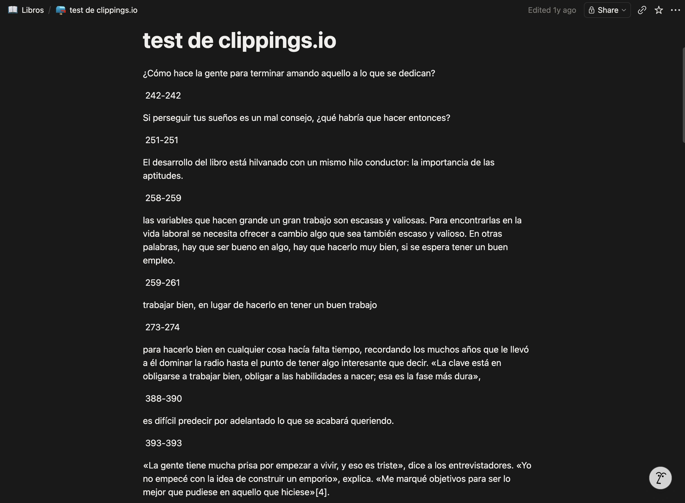

# Notion Scribe — Kindle Clippings Exporter
### Proyecto de automatización y parsing | Python · CLI · Markdown · Notion

---

## Qué es este proyecto

Notion Scribe es una herramienta de línea de comandos que convierte automáticamente los subrayados y notas que hago en mi Kindle en archivos Markdown listos para importar a Notion.

### El origen: una herramienta existente que se quedaba corta

El punto de partida no fue una idea abstracta, sino una frustración concreta. Probé [clippings.io](https://clippings.io), una herramienta de terceros para exportar highlights de Kindle, y el resultado no me convencía: el formato era plano, sin estructura visual útil, sin metadatos relevantes, y sin ningún tipo de asociación entre notas y subrayados.



Eso me llevó a preguntarme cuánto costaría hacerlo yo mismo, con exactamente el output que necesitaba. Este proyecto es la respuesta a esa pregunta.

### Qué es `My Clippings.txt`

Cuando subrayas algo en un Kindle, el dispositivo lo guarda automáticamente en un fichero de texto plano llamado `My Clippings.txt`, que vive en la memoria interna del lector. Este fichero acumula todas tus anotaciones de todos los libros, en el orden en que las hiciste, sin separación por libro ni estructura navegable.

El formato de cada entrada es propietario de Amazon y tiene este aspecto:

```
Blood, Sweat, and Pixels (Jason Schreier)
- Your Highlight on Page 6 | Loc. 49-50 | Added on Thursday, June 13, 2024 10:38:24 PM

Developers everywhere talk about how hard it is to make games.
==========
Blood, Sweat, and Pixels (Jason Schreier)
- Your Note on Page 6 | Loc. 46-48 | Added on Thursday, June 13, 2024 10:28:16 PM

Con todos los imprevistos que surgieron durante el desarrollo...
==========
```

Cada bloque termina en `==========`. No hay estructura jerárquica, no hay relación explícita entre una nota y el subrayado al que pertenece, y el idioma de los metadatos cambia según la configuración del dispositivo. Sin procesar, ese fichero es ilegible en cualquier herramienta externa y prácticamente imposible de buscar o revisar.

Este proyecto resuelve exactamente eso: parsea el fichero, agrupa las anotaciones por libro, une automáticamente cada nota con su subrayado correspondiente, y genera un `.md` por libro con formato limpio, legible y compatible con Notion.

---

## Para qué sirve y a quién ayuda

A cualquier persona que use Kindle para leer y quiera llevar sus subrayados a un sistema de gestión del conocimiento como Notion, sin depender de apps de terceros, suscripciones ni APIs externas.

El caso de uso principal es el mío propio: leo con frecuencia, subrayo mucho y necesitaba poder revisar y buscar mis highlights en Notion sin el proceso manual de copiar y pegar entrada por entrada.

Secundariamente, cualquier persona con conocimientos básicos de Python puede usarlo. No tiene ninguna dependencia externa —no hay `pip install`, no hay cuenta en ningún servicio. Solo Python 3.9+ y el fichero del Kindle.

---

## Herramientas y tecnologías utilizadas

| Elemento | Detalle |
|---|---|
| **Lenguaje** | Python 3.9+ (sin dependencias externas) |
| **Librerías estándar** | `re` (expresiones regulares), `pathlib` (rutas multiplataforma), `datetime` (fechas), `shutil` (copia de ficheros), `sys` |
| **Formato de entrada** | Texto plano UTF-8 — `My Clippings.txt` del Kindle |
| **Formato de salida** | Markdown (`.md`) con sintaxis compatible con Notion |
| **Control de versiones** | Git + GitHub |
| **Sistemas operativos** | macOS y Windows (documentados y probados en ambos) |
| **Herramienta de destino** | Notion — import manual o mediante Notion Importer oficial |

La decisión de no usar dependencias externas fue deliberada: una herramienta personal tiene que funcionar en cualquier momento sin tener que gestionar entornos virtuales ni versiones de paquetes. Cero fricción de instalación.

---

## Problema técnico que resuelve

Los retos técnicos reales que tuve que resolver al trabajar con el fichero:

- **Parsing del formato propietario de Amazon** — El delimitador `==========` no siempre va seguido de contenido válido. Hay bloques vacíos, entradas corruptas y variaciones de encoding (`\ufeff` BOM al inicio del fichero).
- **Soporte multiidioma** — Amazon cambia el idioma de los metadatos según la configuración del dispositivo. Un Kindle en español escribe `Añadido el jueves, 13 de junio de 2024` donde uno en inglés escribe `Added on Thursday, June 13, 2024`. Hay que manejar ambos formatos con regex distintas.
- **Pareado de notas y subrayados** — Una nota en Kindle no referencia explícitamente a su subrayado. La vinculación hay que inferirla comparando rangos de posición (`Loc.`) y, como fallback, coincidencia de página. Si los rangos se solapan, la nota va unida al highlight. Si no hay match, se exporta como entrada independiente.
- **Nombres de fichero seguros** — Los títulos de libros pueden contener caracteres especiales, acentos, dos puntos, comillas. Hay que sanitizarlos antes de usarlos como nombre de fichero.
- **Compatibilidad con Notion** — Notion no renderiza todos los estilos Markdown igual. El formato final (bullets, blockquotes para metadata, separadores `---`) fue elegido tras probar qué sobrevive bien al import.

---

## Cómo lo construí: proceso paso a paso

### Fase 1 — Entender el problema real

Antes de escribir una sola línea de código, pasé tiempo analizando el fichero `My Clippings.txt` a mano. Necesitaba entender:

- Cuántos bloques distintos podía haber (highlight, note, bookmark).
- Si el formato era estable o variaba entre libros y dispositivos.
- Qué información era relevante conservar y en qué orden.

Encontré inmediatamente que la relación nota–subrayado no era explícita en el fichero. Eso se convirtió en el problema central a resolver, y condicionó toda la arquitectura del script desde el inicio.

### Fase 2 — Parseo básico funcional (v1.1d)

El primer script funcional hacía lo esencial:

1. Leer el fichero completo y dividirlo por `==========`.
2. Para cada bloque, extraer título, autor, tipo de anotación, posición y texto.
3. Agrupar todo por libro (título + autor como clave).
4. Generar un `.md` por libro con los highlights como bullets y la metadata en blockquote.

En esta versión ya estaba implementado el pareado de notas con sus subrayados por solapamiento de posición, el soporte para formato de fecha en inglés y español, y la sanitización de nombres de fichero.

Lo que no tenía: backups del fichero original ni log de ejecución.

### Fase 3 — Identificar riesgos y añadir salvaguardas (v1.1e)

Tras usar v1.1d durante un tiempo, identifiqué un riesgo operacional real: el script sobreescribe los `.md` de salida en cada ejecución. Si algo fallaba en el parsing —o si experimentaba con cambios— podía perder el trabajo anterior sin posibilidad de recuperarlo.

Añadí dos mecanismos de seguridad:

- **Backup automático** antes de cada ejecución: copia el `My Clippings.txt` original a `backups/` con timestamp (`My Clippings_20251023_1530.txt`). El fichero fuente nunca se toca; el backup garantiza trazabilidad.
- **Log de ejecución** en `logs/last_run.txt`: registra fecha, número de libros procesados, total de highlights/notas/bookmarks, fichero fuente y nombre del backup generado.

```
2025-10-23 02:03:14 • Books:12 • Highlights:243 • Notes:37 • Bookmarks:5 • Source:My Clippings_20251022.txt • Backup:My Clippings_20251023_0159.txt
```

Esto transforma cada ejecución en algo auditable: puedo saber exactamente qué se procesó, cuándo y desde qué fichero fuente.

### Fase 4 — Experimentación con deduplicación (v1.2 — cancelada)

Intenté añadir lógica de deduplicación: detectar si un highlight ya había sido exportado en una ejecución anterior y omitirlo para no tener duplicados al re-importar a Notion.

Desarrollé la lógica y la probé, pero la descarté antes de mergearla. El motivo: la deduplicación requería comparar el estado actual con un estado anterior, y ese mecanismo introducía falsos negativos —highlights legítimos que se omitían incorrectamente. La inestabilidad del comportamiento era inaceptable para una herramienta cuya función principal es no perder ninguna anotación.

**Decisión de QA:** mantener v1.1e como versión estable y cancelar v1.2 en lugar de publicar algo que funcionaba "casi siempre". Un fallo silencioso en este contexto —perder un highlight sin avisar— es peor que no tener la feature.

---

## Resultado: output en Notion

El resultado final de ejecutar el script es un `.md` por libro que, al importarlo en Notion, se ve así:


Cada libro tiene una cabecera con autor, recuento de highlights/notas/bookmarks, fecha de procesado y fichero fuente. Cada anotación aparece como bullet con su metadata en blockquote debajo, y las notas que escribí van unidas al subrayado al que pertenecen. El formato es completamente navegable y buscable dentro de Notion.

---

## Cómo lo he ido testando

No hay tests unitarios automatizados en este proyecto, y es una decisión consciente que merece explicación.

### Enfoque de validación manual estructurada

El testing fue manual e iterativo, pero con un criterio claro en cada ciclo:

**1. Pruebas con fichero real propio**
El fichero de entrada es mi `My Clippings.txt` personal, con más de 200 highlights de más de 12 libros en inglés y en español. Esto garantizó cobertura de variabilidad real desde el primer día, sin necesidad de fabricar datos de prueba artificiales.

**2. Inspección visual del output**
Tras cada cambio, comparaba el `.md` generado contra el fichero original a mano para verificar:
- ¿Están todos los highlights?
- ¿Las notas están unidas al highlight correcto?
- ¿Los bookmarks se exportan sin perder información?
- ¿El formato se ve bien al importar en Notion?

**3. Comparación entre versiones**
Al pasar de v1.1d a v1.1e, ejecuté ambas versiones sobre el mismo fichero de entrada y comparé los outputs línea a línea. El criterio era claro: v1.1e no puede producir ningún resultado diferente en el contenido de los `.md`, solo añadir backup y log. Esa comparación fue mi test de regresión manual.

**4. Pruebas de edge cases identificados**

| Caso | Qué comprobé |
|---|---|
| Libros sin autor identificado | El script no falla; exporta el libro sin campo autor |
| Nota sin highlight asociado | Se exporta como entrada independiente, no se pierde |
| Bookmark sin texto | Se representa como "Bookmark at Page X" |
| Título con caracteres especiales (`:`, `"`, `¿`) | El nombre de fichero se sanitiza correctamente |
| Fichero en español (Kindle configurado en ES) | Fechas y tipos de anotación se parsean correctamente |
| Fichero con BOM (`\ufeff`) | Se elimina antes del procesado |
| Ejecución sin `My Clippings.txt` presente | Mensaje de error claro y salida controlada |

**5. Validación en destino**
El test final siempre fue importar el output en Notion y verificar que el formato sobrevive al import: que los bullets se renderizan como lista, que los blockquotes aparecen como blockquotes, y que los separadores `---` funcionan como divisores visuales.

### Por qué no automaticé los tests

Añadir tests unitarios habría requerido crear fixtures de `My Clippings.txt` con casos conocidos. Es factible, pero supone un trabajo adicional que no estaba justificado para una herramienta de uso personal con un único contribuidor. El riesgo de regresión lo gestioné con la comparación manual entre versiones y con el backup automático incorporado al propio script —que actúa como red de seguridad ante cualquier fallo inesperado.

Si el proyecto escalara a múltiples contribuidores, o si el formato de Amazon cambiase con frecuencia, los tests automatizados serían el siguiente paso natural.

---

## Decisiones de diseño relevantes

**Sin dependencias externas.** Podría haber usado librerías como `click` para la CLI o `pytest` para los tests. Decidí no hacerlo para que cualquier persona pueda clonar el repo y ejecutarlo inmediatamente sin pasos adicionales.

**Backup antes de procesar, no después.** El backup se hace al inicio de la ejecución, antes de que el script toque nada. Si el script falla a mitad, el backup ya está hecho. El orden importa.

**Separadores `---` en el output.** Notion tiene comportamientos inconsistentes con algunos elementos Markdown. Los separadores horizontales son uno de los pocos elementos que se renderizan de forma fiable en imports. La elección no fue estética, fue funcional.

**Multiidioma configurable, no automático.** La detección automática del idioma por libro fue evaluada y descartada porque generaba falsos positivos en títulos con palabras en varios idiomas. El enfoque de configuración explícita (`PER_BOOK_LANG`) es menos "mágico" pero más predecible y menos propenso a errores silenciosos.

---

## Estructura del repositorio

```
Kindle-Enhanced-Clippings-Exporter/
├── parse_kindle_notion_v1_1e.py       # Script principal (versión estable)
├── parse_kindle_notion_v1_1d.py       # Versión anterior (referencia)
├── parse_kindle_notion_v1_2_1_fix.py  # Experimento cancelado (v1.2)
├── README.md
├── Books/                             # Output: un .md por libro
├── backups/                           # Copias del My Clippings.txt con timestamp
└── .gitignore
```

Las versiones anteriores se mantienen en el repositorio de forma intencionada: sirven como referencia de la evolución del proyecto y permiten entender qué se añadió y qué se descartó en cada iteración.

---

## Historial de versiones y criterio de evolución

| Versión | Estado | Cambios principales | Motivo |
|---|---|---|---|
| v1.1d | Estable (retirada) | Parsing completo, pareado nota–highlight, multiidioma, output Notion-friendly | Base funcional sólida |
| v1.1e | **Estable actual** | Backup automático antes de cada ejecución, log de ejecución con trazabilidad completa | Reducción de riesgo operacional |
| v1.2 | Cancelada | Deduplicación de highlights ya exportados | Falsos negativos inaceptables: riesgo de perder anotaciones silenciosamente |

---

## Próximos pasos y mejoras futuras

**Lo que haría si continuase el proyecto:**

- **Tests unitarios con fixtures**: crear un conjunto de fragmentos de `My Clippings.txt` que cubran todos los edge cases identificados y verificarlos automáticamente en cada cambio.
- **Integración con la API de Notion**: en lugar de generar `.md` para import manual, crear o actualizar páginas directamente vía API. La limitación actual es que requiere un token de integración y es más complejo de configurar para usuarios no técnicos.
- **Modo dry-run**: ejecutar el script sin escribir ningún fichero, solo mostrando qué se procesaría. Útil para verificar el parsing antes de sobreescribir los outputs.
- **Soporte para más idiomas de Kindle**: el formato de metadatos varía en dispositivos configurados en francés, alemán o portugués. Actualmente solo inglés y español están cubiertos.

**Lo que no haría:**

Reintroducir la deduplicación de v1.2 hasta tener una estrategia de comparación que garantice cero falsos negativos. La fiabilidad del output tiene prioridad sobre la conveniencia.

---

## Repositorio

[github.com/melinDross/Kindle-Enhanced-Clippings-Exporter](https://github.com/melinDross/Kindle-Enhanced-Clippings-Exporter)

---

*Proyecto personal — Sam Barrado · QA Lead*
